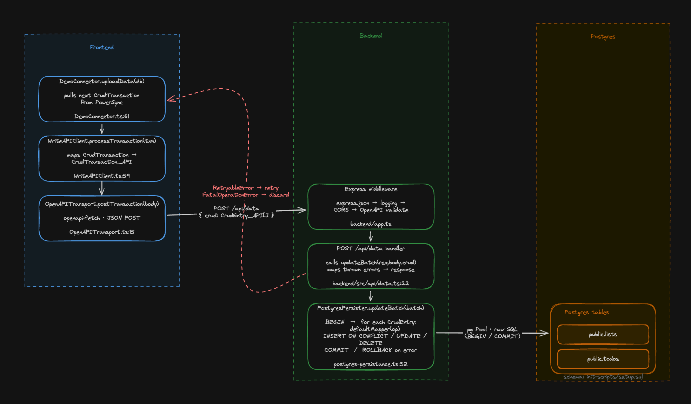
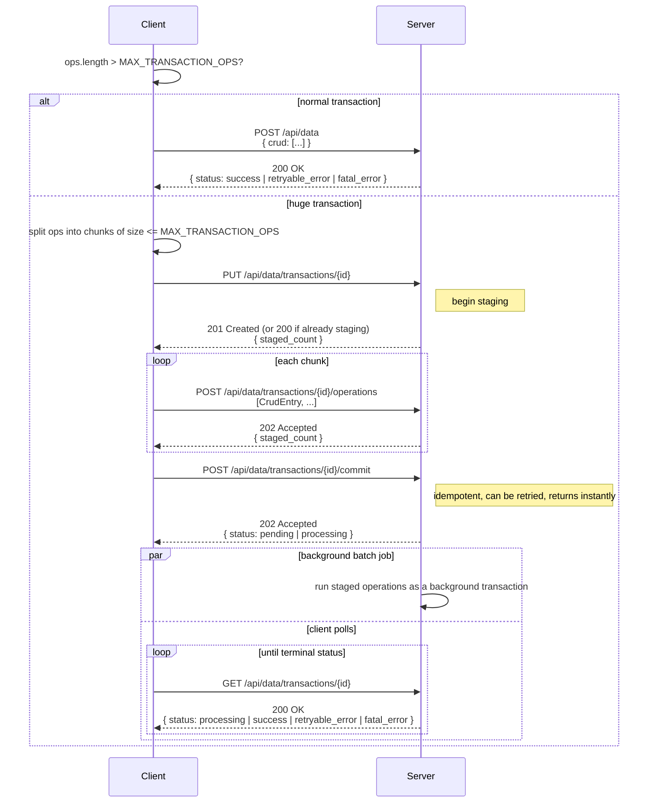

# PowerSync Write API Demo



## Project Layout

```
write-api/
├── docker-compose.yaml                       # Postgres + MongoDB + PowerSync
├── config/
│   ├── powersync.yaml                        # PowerSync service config
│   └── sync_rules.yaml                       # Sync rules (lists + todos)
├── init-scripts/
│   └── setup.sql                             # DB schema + seed data
├── powersync-nodejs-backend-todolist-demo/    # Backend (Express, port 6060)
│   └── .env
└── demo-app/                                 # Frontend (React/Vite, port 5173)
    └── .env.local
```

## Running Everything

```bash
# 1. Start infrastructure (Postgres, Mongo, PowerSync)
docker compose up -d

# 2. Start backend (new terminal)
cd backend && pnpm install && pnpm start

# 3. Start frontend (new terminal)
cd frontend && pnpm install && pnpm dev
```

- Frontend: http://localhost:5173
- Backend: http://localhost:6060
- PowerSync: http://localhost:8080
- Postgres: localhost:5432

## Huge Transaction Flow

`openapi.yaml` defines a stage/commit/poll flow for transactions too
large to fit in a single `postCrudTransaction` call. The client decides
which option to use by comparing the transaction's op count against a
configured `MAX_TRANSACTION_OPS`. If too long, the transation's operations are split into chunks and staged in batches before the transaction is committed.



## Generating Types from OpenAPI Spec

Both the backend and frontend generate TypeScript types from the shared `openapi.yaml` spec.

```bash
# Backend (generates src/generated/api.ts)
cd backend && pnpm generate-types

# Frontend (generates src/generated/api.d.ts)
cd frontend && pnpm generate
```
